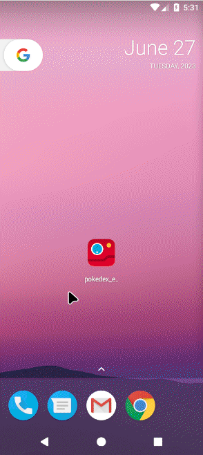

<h1 align="center">
    
    <br>
    Pokedex App
</h1>

<h4 align="center">
  Sua enciclopédia virtual de pokémons.
</h4>
<!-- <p align="center">
  

  <!-- 

   
  <a href="https://github.com/francis584/TMDb-App/commits/master">
    
  </a>

  <a href="https://github.com/francis584/pokedex-egsys/issues">
    

  </a>

  
</p>-->

<p align="center">
  <a href="#rocket-tecnologias">Tecnologias</a>&nbsp;&nbsp;&nbsp;|&nbsp;&nbsp;&nbsp;
  <a href="#information_source-como-usar">Como usar</a>&nbsp;&nbsp;&nbsp;
</p>

<p align="center">
  
  
</p>

## :rocket: Tecnologias

Esse projeto foi desenvolvido como um teste para uma vaga com as seguintes tecnologias:

- [ASP - Atomic State Pattern](https://pub.dev/packages/asp)
- [Equatable](https://pub.dev/packages/equatable)
- [Uno](https://pub.dev/packages/uno)
- [Auto_injector](https://pub.dev/packages/auto_injector)
- [Flutter_svg](https://pub.dev/packages/flutter_svg)
- [Shimmer](https://pub.dev/packages/shimmer)
- [Fluttertoast](https://pub.dev/packages/fluttertoast)
- [Go_router](https://pub.dev/packages/go_router)
- [Flutter_native_splash](https://pub.dev/packages/flutter_native_splash)
- [smooth_page_indicator](https://pub.dev/packages/smooth_page_indicator)
- [Animated_text_kit](https://pub.dev/packages/animated_text_kit)
- [Shared_preferences](https://pub.dev/packages/shared_preferences)
- [Flutter_launcher_icons](https://pub.dev/packages/flutter_launcher_icons)
- [Flutter_lints](https://pub.dev/packages/flutter_lints)
- [Mocktail](https://pub.dev/packages/mocktail)
- [Dart_code_metrics](https://pub.dev/packages/dart_code_metrics)

## :information_source: Como usar

Para clonar e executar este App, você irá precisar: [Git](https://git-scm.com) e do [fvm][fvm] instalado no seu computador. Do seu terminal de comando:

```bash
# Clone o repositório
$ git clone https://github.com/francis584/pokedex-egsys

# Entre no repositório
$ cd pokedex-egsys

# Instale as dependências
$ fvm install
$ fvm flutter pub get

# Rodar o app no Android
$ fvm flutter run -d emulator

# Rodar testes
$ fvm flutter test
```

---

Made with ♥ by Francinildo Rodrigues :wave: [Get in touch!](https://www.linkedin.com/in/francinildo-rodrigues/)

[fvm]: https://fvm.app/
[vc]: https://code.visualstudio.com/

